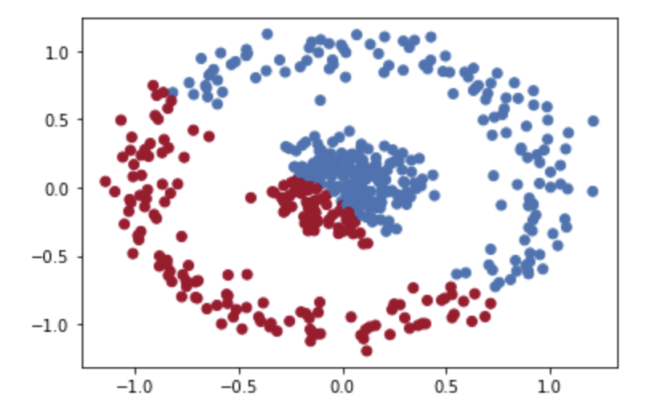

# cluster

This report is organized in following topics:
1. What is Kmeans
2. How does it work / Algorithm
3. Visualization with K-means in 1 or 2 dimension(s)
4. Issues with K-means / Improvement
      - kmeans++ 
      - spectral clustering
5. Kmeans accuracty
6. Kmeans application 

## 1. What is Kmeans
K-means is an unsupervised machine learning algorithm that is designed to group similar data points together based on their similarity. Depends on how many groups (or also knowns as clusters) we are trying to define, we want to group our data points into their corresponding clusters as the main objective. "K" here is a generic term indicating there could be however many of clusters we prefer to create.

There are two terms that need to be clarified here, one is "unsupervised" the other is "similarity". K-means is unsupervised model because the input data is not labelled. However, the algorithem will allocate each data point to a cluster. "Similarity" in this context specifically means the euclidean distance between a data point and center of a cluster.

## 2. How does it work / Algorithm
- Randomly initiate K centroids (pre-determined cluster center) in the same vector space as the data
- Calculate the distance between each data point and each centroids; find the nearest centroid to the data point and allocate this data point to this cluster
- After all the data points are assigned to their nearest centroids, compute the mean of the current cluster and update the cluster centroid to the new mean we just calculated
- Repeat step 2 allowing each data point to find their nearest centroid again
- Repeat step 2 to 4 until one of the following conditions is met:
      - k centroids have been samples
      - run out the max number of iterations

## 3. Visualization with K-means in 1 or 2 dimension(s)

with basic k-means algorithm, we can see 1D or 2D dataset can be clustered as following:

<table border="0">
<tr valign="top" border="0">
<td border="0"></a></td>
<td border="0"></a></td>	
</tr>
</table>

However, if we re-run the algorithm, we get very different clustering result

<table border="0">
<tr valign="top" border="0">
<td border="0"></a></td>
<td border="0"></a></td>	
<td border="0"></a></td>	
</tr>
</table>

## 4. Issues with K-means / Improvement

Given the visualizations shown above, we noticed following issues:
- This algorithm does not give the best clustering result (inner circle should be clustered together while the outer circle belongs to a different cluster)
- Initializer K drastically impact the clustering result
- when the data has a more complex patter (like the "circle" above), the algorithm does not have accurate result

:rocket: Improvement #1: Implement Kmean ++

The idea of Kmean++ is one of the improvements we can do in order to make the initialization result closer to the optimal (less random than just Kmeans).

- Step 1: we first randomly select one initial point
- Step 2: for the rest points (k-1), we will compute the minimum distance between each data point and previously chosen centroid. Once we have a list of the minimum distance for each datapoint, we will find the maximum distance.
      - the intuition behind this is the point having the maximum distance from the nearest centroid is most likely to be cohsen as the next centroid
- Step 3: Repeat step 1 and 2 until all the K centroids are chosen

<table border="0">
<tr valign="top" border="0">
<td border="0"></a></td>
<td border="0"></a></td>		
</tr>
</table>

:rocket: Improvement #2: Improving with kmeans++ and spectral clustering

- **compute similiarty graph**; whether it is KNN, fully connected or ε-neighborhood graph, we are trying to create a connection between all the points.
- **convert the data to low-dimensional space**; sometime the data points to be far from each other (coule be farther way than a data point in a different cluster), but that does not mean they are not connect. So the objective is to cluster everything that is close to each other when data set is converted into a low-dimension space.
- **create the cluster**; using the second eigenvalue to assign values (2nd vector indicates how closely connected the data are in a graph)

## 5. Kmeans accuracty

## 6. Kmeans application 

<table border="0">
<tr valign="top" border="0">
<td border="0"></a></td>
<td border="0"></a></td>		
</tr>
</table>

## Conclusion

In summary, we have looked at the definition of what kmeans does, how the algorithm is implemented. We then looked at the visual representation on how Kmeans is applied for 1D, 2D or multiple-Dimension datasets. During the process we noticed:

- the initial k centroid heavily impact the final result
- data complexity also influence the kmeans performance

In order to overcome these obsticles, we have done the following two methods:

- we implemented a new method to select initializer k, which is known as kmeans++.
- we tried to used spectral clustering method to completely overcome data complexity

Lastly, we applied kmeans methods to one of the real-world applications - image compression. We tried both on greyed picture and colored pictures. We noticed that the more clusters we have, the longer it takes the algorithm to run, which indicates that kmeans could be very expensive to run on a scale.
